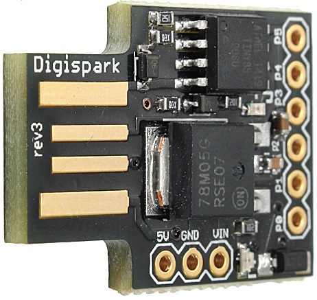
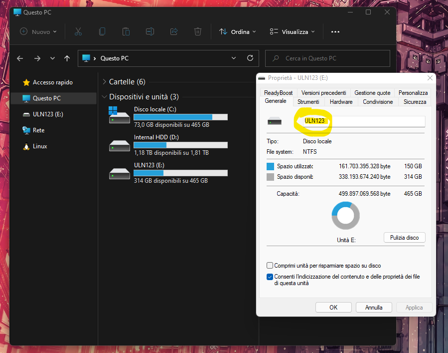

# Local Data Stealer (with Digispark ATTiny85)
A simple script to steal data from a local system using a Digispark + Powershell. Usefull if you have physical access to the machine (Windows only).

Use this script at your own risk. The author assumes no responsibility for any illegal or improper use of the code.

# How does it work?
The Digispark device will act as an automatic keyboard: as soon as it is inserted into the victim machine, it will write and execute a malicious Loader.
The Loader will download a second stage from the Internet which will search for a USB drive with a certain disk Label. The entire user profile (except the excluded folders configured in the script) will be copied to that drive.

Loader and second stage are written in Powershell.

I have tested this script with Digispark ATTiny85 (on Windows 10 and Windows 11):



# What do you need?
1. Set up Arduino IDE to make it work with your Digispark device (follow the instructions here: http://digistump.com/wiki/digispark/tutorials/connecting)
2. Install latest Digistump driver (download DigistumpDriver.zip from here: https://github.com/digistump/DigistumpArduino/releases)
3. Chose an external USB drive (presumably with enough space to be able to store all the files contained in the profile of the victim machine) and set a custom disk label:

4. Modify "lds.ps1" (second stage): 
   - set `$dsl` variable with the disk label you have chosen
   - add folders you DON'T want to copy to `$itefc`
   - variable `$mwt` represents the number of seconds the script searches for the disk to copy the data to. When the time runs out, if no disk with a valid label has been found, the script terminates
    ```
    $dsl = "ULN123";
    $itefc = @('MicrosoftEdgeBackups','AppData','Musica');
    $mwt = 30;
    ```
5. Put "lds.ps1" (second stage) on your web site, Git repository or wherever you want. Remember: the remote resource must contain the Powershell code ONLY (no extra HTML code or data of any sort) otherwise it will not work! Alternatively you can use the file in this repository. If you decide to put the second stage on your website remember to modify "lds.ino" (Digispark Loader code) inserting the new link in the `DownloadString()` function. Otherwise leave the code as it is.
6. Upload "lds.ino" to your Digispark using Arduino IDE

# What next?
At this point you should have your Digispark configured to execute the Loader, the second stage available on the Internet and an external USB drive for the data exfiltration.
Put your hard drive on the victim machine and insert the Digispark.
You should see the "Run" program pop up on the bottom-left side of the screen:


The Digispark device will write the Loader into "Run". The Loader will download and execute your second stage that will check for X seconds (where X is equivalent to `$mwt` set before; default value is 30) if a drive with the disk label equivalent to the previously set value of `$dsl` is connected to the machine. If the drive is not detected in this time frame, the script execution will terminate; otherwise, the data exfiltration will start. At the end of the procedure the message "Process completed" will be shown.

Now you can unplug your devices.

# Notes
- After the execution of the second stage, the Digispark device will try to eliminate its traces by performing some operations (for 10 seconds you should see some windows open and close; to see what it does in detail, please read the comments in the source code). After this period of time you can disconnect the Digispark device even if the second stage is copying data to the external disk. Before disconnecting the external disk, wait to see the message "Process completed" or the copy operation will fail/will be partial.
- If the victim system has a Default Terminal Application other than "Windows Console Host" (for example the new "Windows Terminal") the Powershell window of the second stage may not be invisible during the whole copy operation!
- Test carefully (several times) that everything is working correctly in a test environment before using the data stealer
- The source code of the second stage may seem difficult to understand: it uses Powershell Aliases, deliberately incomprehensible variable names and a synthetic syntax. This was done on purpose to decrease the number of characters present in the script in order to increase the download speed during the infection (and prevent the script's functionality from being obvious to any expert users who may look for traces of compromise on the network or in the system).
- The division between Loader and Second stage was necessary for several reasons:
  1. The DigiKeyboard library (used in the project) may insert incorrect special characters depending on the keyboard layout. This prevents writing complex payloads
  2. Even if you want to use a Base64 encoding for your payload (see for example: https://docs.microsoft.com/en-us/powershell/module/microsoft.powershell.core/about/about_powershell_exe?view=powershell-5.1#-encodedcommand-base64encodedcommand) to avoid inserting special characters ATTiny85 has only 6012 bytes of memory: it is not possible to save too long/complex codes
  3. A payload that is too long means that the writing operations of the Digispark device will be visible on the screen for a longer time. This makes the exfiltration operation more obvious
